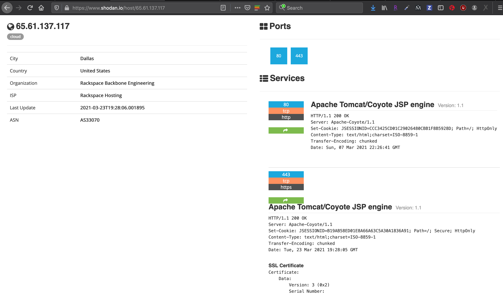
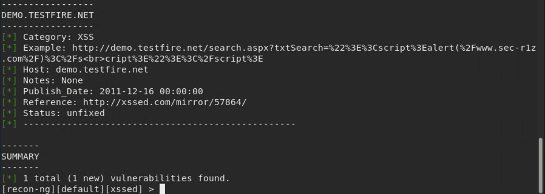
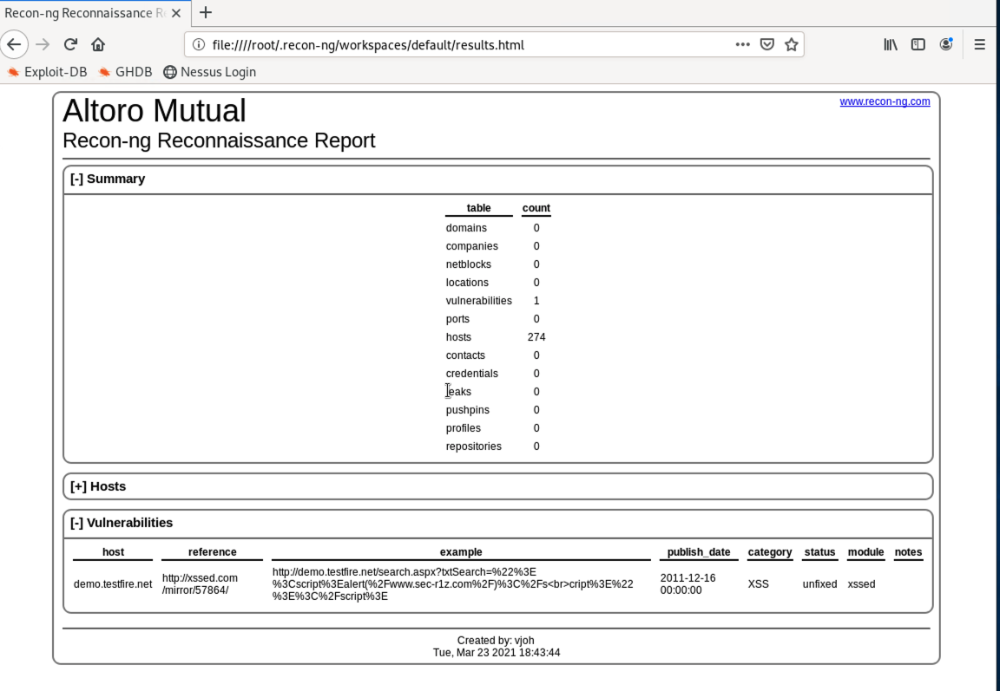

## Week 16 Homework Submission File: Penetration Testing 1

#### Step 1: Google Dorking

- Using Google, can you identify who the Chief Executive Officer of Altoro Mutual is: Karl Fitzgerald
- http://altoromutual.com/index.jsp?content=inside_executives.htm

- How can this information be helpful to an attacker:
- An attacker could do more OSINT research and find more social media sites that Karl participates on. With the information that's collected a more customized phishing email could be built for Karl. Also any information that's publicly available could be used in a social engineering campaign against Karl. 

#### Step 2: DNS and Domain Discovery

Enter the IP address for `demo.testfire.net` into Domain Dossier and answer the following questions based on the results:

  1. Where is the company located: Sunnyvale, CA

  2. What is the NetRange IP address: `65.61.137.64 - 65.61.137.127`

  3. What is the company they use to store their infrastructure:
  CustName:       Rackspace Backbone Engineering
  Address:        9725 Datapoint Drive, Suite 100
  City:           San Antonio
  StateProv:      TX

  4. What is the IP address of the DNS server: `65.61.137.117`

#### Step 3: Shodan

- What open ports and running services did Shodan find: 
- Ports 80 (HTTP) and 443 (HTTPS): Apache Tomcat/Coyote JSP Engine Version 1.1

#### Step 4: Recon-ng

- Install the Recon module `xssed`. 
- Set the source to `demo.testfire.net`. 
- Run the module. 

Is Altoro Mutual vulnerable to XSS: Yes. 

Below is the Recon-NG generated report.

### Step 5: Zenmap

Your client has asked that you help identify any vulnerabilities with their file-sharing server. Using the Metasploitable machine to act as your client's server, complete the following:

- Command for Zenmap to run a service scan against the Metasploitable machine: 
`nmap -sV 192.168.0.10`
 
- Bonus command to output results into a new text file named `zenmapscan.txt`:
`nmap -sV -oN zenmapscan.txt 192.168.0.10`

- Zenmap vulnerability script command: `nmap --script=samba-vuln-cve-2012-1182  -p 139 192.168.0.10`
- Reference: https://nmap.org/nsedoc/scripts/samba-vuln-cve-2012-1182.html

- Once you have identified this vulnerability, answer the following questions for your client:
  1. What is the vulnerability:
  "The RPC code generator in Samba 3.x before 3.4.16, 3.5.x before 3.5.14, and 3.6.x before 3.6.4 does not implement validation of an array length in a manner consistent with validation of array memory allocation. "
  Definition courtesy of National Vuln. DB by NIST: https://nvd.nist.gov/vuln/detail/CVE-2012-1182

  2. Why is it dangerous: Also according to NIST, tt allows remote attackers to execute arbitrary code via a crafted RPC call. 

  3. What mitigation strategies can you recommendations for the client to protect their server: 
  - Install the patch that can be found here: http://www.samba.org/samba/security/
  - Upgrade to a newer version of Samba if your system allows it.
  - There is also a work around provided by Samba.com that would help restrict access via an allow list: 
  Samba contains a "hosts allow" parameter that can be used inside smb.conf to restrict the clients allowed to connect to the server to a trusted list. This can be used to help mitigate the problem caused by this bug but it is by no means a real fix, as client addresses can beeasily faked.
https://www.samba.org/samba/security/CVE-2012-1182

---
© 2020 Trilogy Education Services, a 2U, Inc. brand. All Rights Reserved.  

